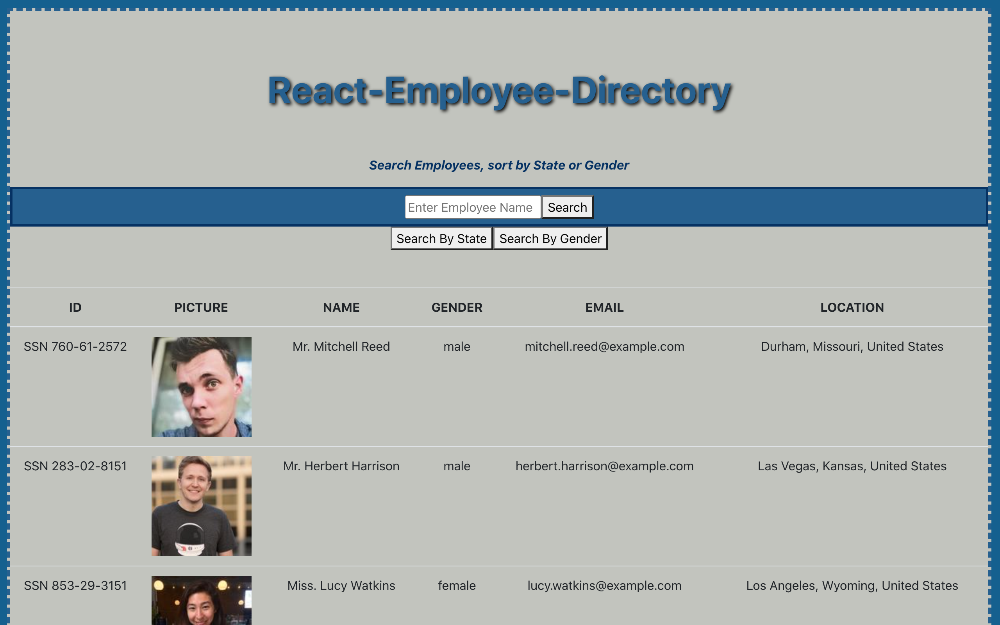
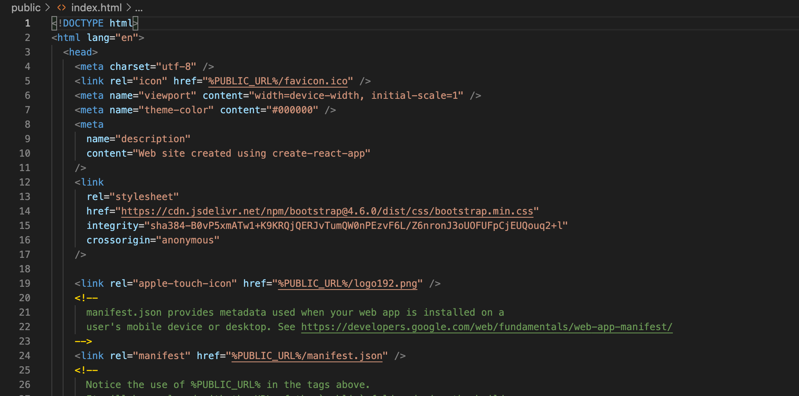
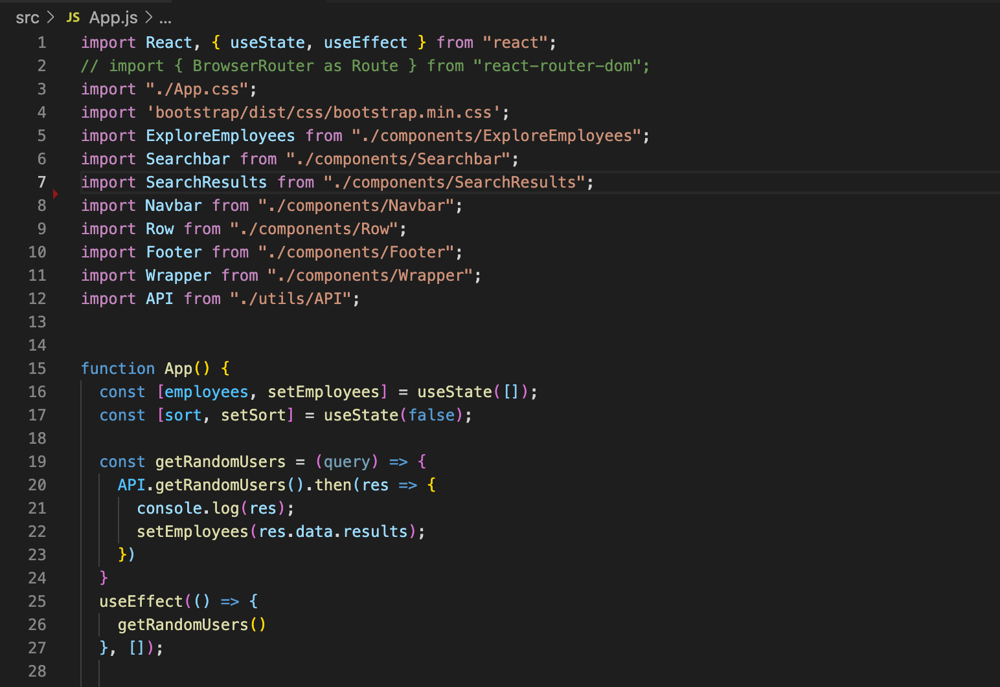
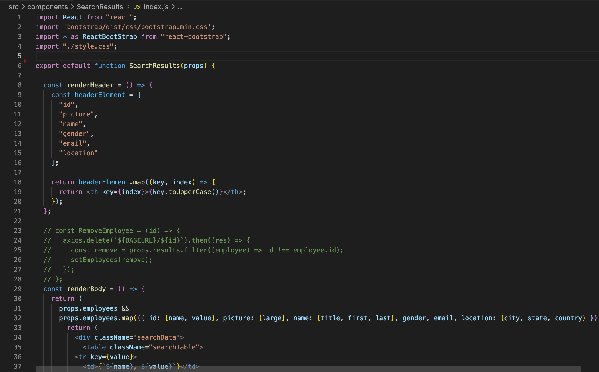

# React-Employee-Directory
To create an Employee Directory with Reactjs. By utilizing components, managing components states and responding to user events, we will separate the application's UI.

## Project Description

Company's Employee Directories can be very useful tools. Whether it be heavily relied on by new recruites, in the onboarding process, across departments, or for customer service purposes, having access to a databse that list all employees is a necessity. An employee or manager would benefit greatly from being able to view non-sensitive data about other employees. It would be particularly helpful to be able to filter employees by name. This application will implement Reactjs to do all the things listed herein, with the assistance of Random User API.

## User Story

* As a user, be able to view entire employee directory at once as to have quick access to employee information.

The user should be able to:

  * Sort the table by at least one category

  * Filter the users by at least one property.

## Demo Features:
* The following image and gif shows the web application's appearance and functionality:

 React-Employee-Directory App

 React-Employee-Directory gif

## Live URL:
<a href="https://sjohn214.github.io/React-Employee-Directory/">React-Employee-Directory Git Pages</a>

<a href="https://github.com/sjohn214/React-Employee-Directory.git">React-Employee-Directory GitHub Repo</a>

<a href="https://youtu.be/dCsE9cXyd6I">React-Employee-Directory Youtube Demo</a>

## Summary
* In this project we will create a user responsive UI application using Reactjs to access a company's Employee Directory. The database for the application uses Random User API and will allow users to sort employees by name and allow users to access external links for further employee research.

## Special Features:
* HTML page
  * Index.html
  
 Index.html Public file

* CSS elements 
  * Bootstrap css stlying on Index.html.
  
 CSS Style file 

* Javascript page

 App.js file

  * Variables
  * Arrays with objects
  * UseState
  * UseEffect 
  * Sorting Ascending and Descending
  * Filtering Employee name through search
  * API Keys
  * .gitignore
  * Functions
  * Props

 Search Results rendering files

 

## Authors
* Shannondale Page (student) <a href="https://github.com/sjohn214">Git Hub Profile</a>
* Austin Bruch (Bootcamp Instructor)
* Jon Jackson (Bootcamp TA Instructor)
* Daniel Sires (Bootcamp Tutor)